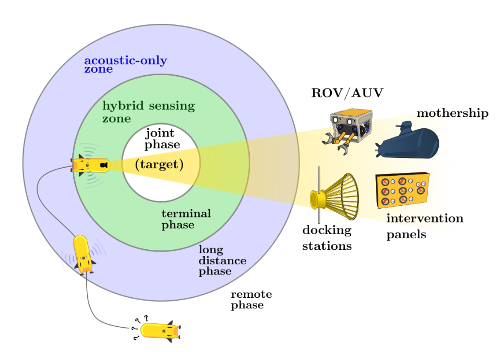
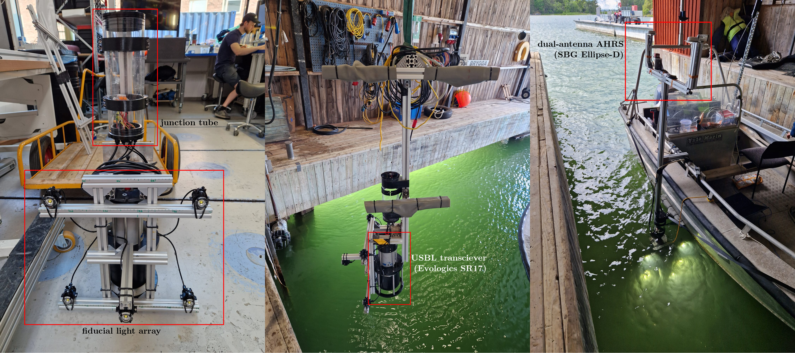
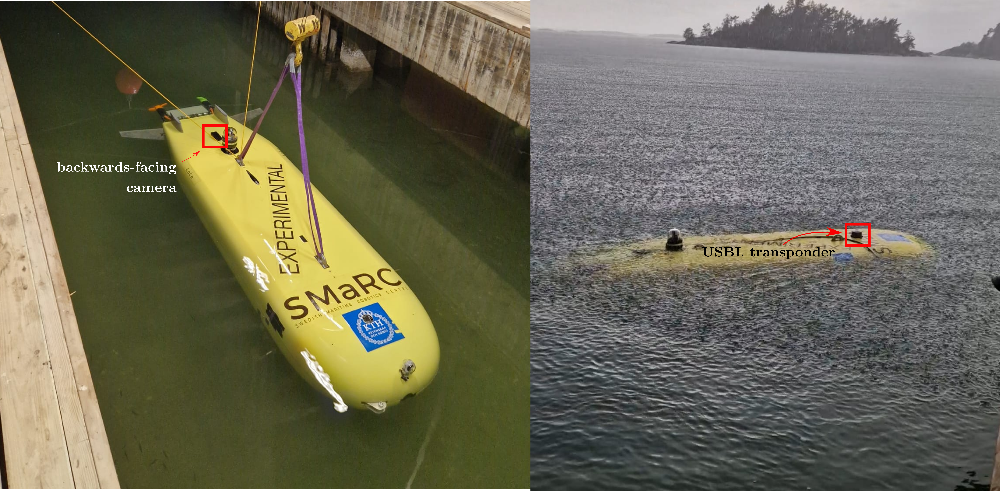
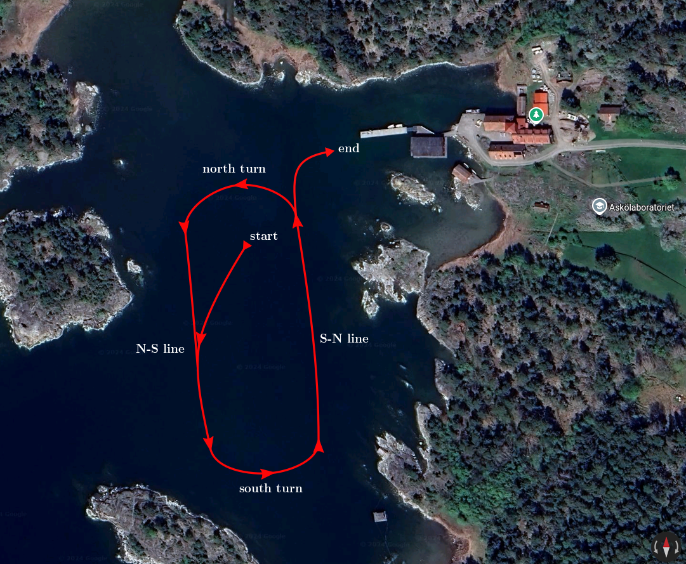
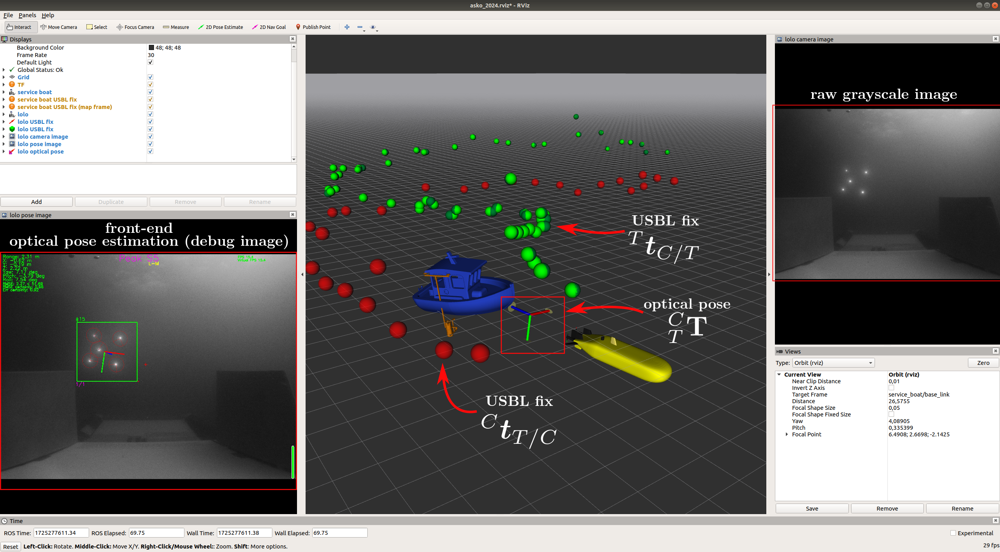

# Askö 2024 prox-ops datasets
This repo serves as a compilation of information, links, and code
that is relevant for the use and reproduction of the datasets
gathered by Niklas Rolleberg, Clemens Deutsch, and Aldo Teran (from the 
Centre for Naval Architecture at the KTH Royal Institute of Technology 
in Sweden) using SMaRC's AUV LoLo at the Baltic Sea Center's Askölaboratoriet.

## Background
The big picture of our research is to enable autonomous proximity operations using AUVs.
The scenario of an arbitrary prox-op consists of two agents, a __chaser__ agent (an AUV in our case),
and a __target__ agent that can be anything from a static docking station, to a dynamically active
mothership; the __chaser__ navigates through a set of phases with **specific sensor modalities and challenges**
before reaching its target. This framework is borrowed from spacecraft robotic prox-ops, and it’s 
used to organize and tackle the different problems that arise during the different phases in a
holistic manner. The figure below depicts the different phases of a proximity operation.

The datasets presented here were gathered with the main purpose of using them to verify 
state estimation and target tracking algorithms that solve the inference problems
that arise when executing proximity operations with a collaborative target underwater.

### Experimental setup
The experiments were carried out just outside of the Askolaboratoriet research station,
in a bay that is protected from major currents and wind.

The objective of the experiments was to simulate an underwater scenario where a mothership (target)
rendezvous with an AUV (chaser), with the goal of, for example, transferring data through an optical communication
link without the need to stop or hard-dock. Thus, throughout the experiments, both vehicles are
(almost) always in motion.

> [!NOTE]
> TODO(aldoteran) would be nice to have a simplified figure with frames of references depicted
> for both the AUV and the vessel (to make calibrations more intuitive to understand as well).

As a surrogate for the mothership, we instrumented our service boat with (1) an SBG Ellipse-D
AHRS for navigation data, (2) an Evologics SR17 USBL positioning system to track and communicate
with the AUV during the long-distance phase, and (3) an array of BlueRobotics Lumen underwater lights
that serve as a fiducial marker during the terminal phase of the operation (see image below). This sensor
suite was interfaced to a laptop using ROS onboard the service boat.

The AUV LoLo is equipped with a plethora of scientific payloads, however, for the sake of
our experiments we only gathered the data from the sensor suite used for relative navigation,
composed of: (1) an iXBlue (now Exail) ROVINS inertial navigation system (INS) with a 
Nortek DVL, (2) an Evologics SR17 transponder and acousitc communication modem, and (3)
a Flir Blackfly S GigE - BFS-PGE-27S5C-C machine vision camera with a Kowa LM5JCM | 2/3" 5mm
wide angle lens inside a BlueRobotics 2" pressure vessel with an optically clear dome lid.
LoLo has an onboard "scientist" computer, a Jetson AGX Orin, that is in charge of data
acquisition also using ROS.

> [!IMPORTANT]  
> Because the AUV is NOT equipped with USBL positioning
(only the unit on the boat is capable of range-bearing measurements of the transponder on LoLo),
the measurement obtained by the service boat's USBL unit are sent to the AUV via acoustic link.
Thus, the USBL fixes that the AUV acquires of the service boat are bound to have a (probably small
but unknown) delay.

#### Experiments description

Three deployments were carried out using the experimental setup above (it was like 10 in reality but
the stars aligned only in 3 of them). The deployments consisted on LoLo diving at an (almost) constant
depth and velocity in a ca. 500m circuit (see figure below). The datasets differ in the number of
laps that LoLo did during the deployment.

Since LoLo was running "open-loop," that is, without having any feedback of our whereabouts in
the service boat, it was up to us to use the USBL positioning system to find and get close enough
for the AUV to capture images of the light fiducials--effectively generating data of a simuluated
long- to terminal-phase proximity operation. We carried out the rendezvous maneuver in a series of
different manners: (1) following at acoustic distance and then closing up in a straight line, (2)
following parallel to the AUV and then merging to present the lights to the camera, (3) intercept
from a long distance and in an angle, and (4) combinations of the above.

> [!NOTE]  
> TODO(aldoteran): adding figure to pictorially depict (1), (2), (3), and (4) would be nice.

## Description and instructions for reproducing the datasets

The data consists of three different datasets composed of the merged rosbags of both vehicles.
Because both systems were running on network time, always having internet connection (except when
underwater of course), we assumed their clocks to be synced enough for a simple merge of the timestamped
data to be accurate. Careful qualitative assesment of the post-processed and merged data seems to
confirm that there are no big, perceivable, delays.

The topics in the rosbags are divided into a series of namespaces, for LoLo's data:
- `/lolo/core/`: raw data mainly from the navigation sensors.
- `/lolo/dr/`: processed navigation data (dr = dead reckoning), essentially navigation data in friendlier rosmsgs.
- `/lolo/sensors/`: payload sensor information; the most important here is the `camera/image_mono` topic with the
                    compressed unprocessed image of the backwards-facing camera.
- `/lolo/perception/`: post-processed data from the acoustic comms (USBL fix), and the calculated relative pose of
                       the light fiducials wrt the AUV's camera.

The service boat's data follows:
- `/evologics/`: raw data from the Evologics USBL positioning system.
- `/sbg/`: data from the SBG AHRS with their own message types.
- `/imu/`: data from the SBG AHRS in standard rosmsgs.
- `/service_boat/`: processed navigation and USBL data.

### Instructions
You have to make sure to have the following dependencies installed in your workspace:

- The [dmac ROS driver](https://github.com/aldoteran/dmac.git): we need the message definitions for the Evologics USBL.
- Same for the AHRS data, you need the [sbg ROS driver](https://github.com/SBG-Systems/sbg_ros_driver.git).

To set up the TF tree and the robot model LoLo, you need

- the [asko-2024 branch of lolo\_common]().

and for the service boat

- the asko-2024 branch of the [usbl\_tools](https://github.com/aldoteran/usbl_tools/tree/asko_2024) package.

Download the datasets from our OneDrive server [here](https://kth-my.sharepoint.com/:f:/g/personal/aldot_ug_kth_se/ElmUbhEgi4hJmvrfleEpzFIB8VFTXjCV7zBi3iisAOBAOw?e=FyPgI3).
Now, run a `roscore` in a separate terminal and get it out of the way. Set the rosparam `use_sim_time` to
`true`. Next, run the RViz configuration from this repo:
- `rviz -d /path/to/this/repo/config/asko_2024.rviz`

For some reason that I don't understand, we must run the `robot_description` for both
vehicles in order to set up their TF trees (somehow they don't get set up from the rosbags):
- `roslaunch lolo_description lolo_description.launch`

and
- `roslaunch usbl_tools boat_description.launch`

You can go ahead and `ctrl-c` both nodes after they've been set up on RViz.
Finally, go ahead and `rosbag play` any of the datasets.

If all of the above went smoothly, you'll see the following RViz screen.

## Known issues
- The service boat's filtered navigation in the 2024-06-11-17-28-05 dataset is very noisy.
It has strange biases and drifts from time to time. Challenging to work with.

